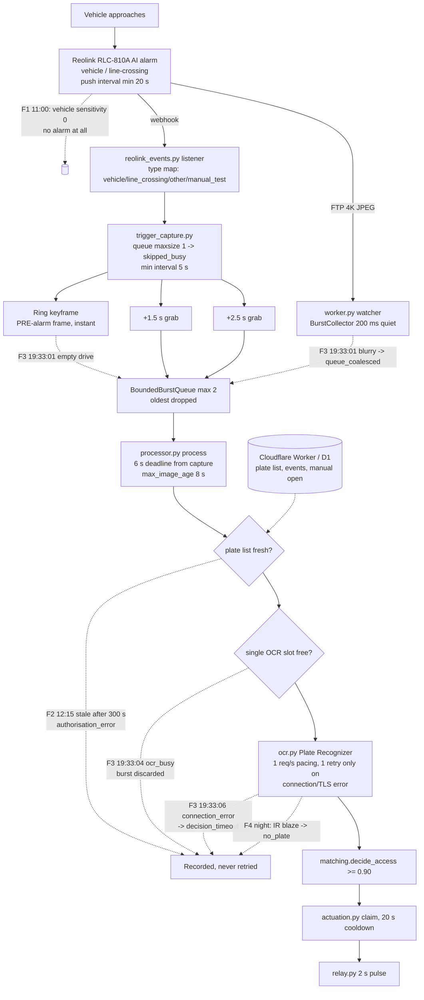
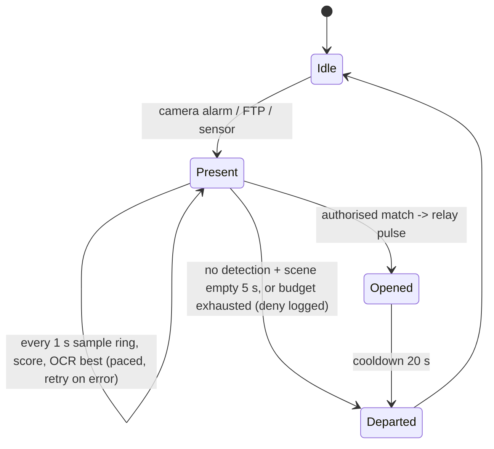

# Gate controller design review (first principles), 2026-09-05

Read-only review by a sub-agent against the checked-out tree at `c7d0a7c`
(after PRs #75, #76, #77; before #78). Paths are under `gate_controller/`.
A short "status since" note at the end records what has been acted on.

## 1. How it works today

The camera decides when something happened: its built-in AI raises an alarm
when it thinks a vehicle appeared or crossed a drawn line. That alarm reaches
the Pi two ways: a webhook message over the LAN, and a 4K JPEG dropped into an
FTP folder. On the webhook, the Pi immediately hands over the newest frame it
already has in memory from the camera's video stream (a frame taken *before*
the alarm), then waits 1.5 s and grabs two more frames one second apart. Each
of those frames, and the FTP JPEG, becomes a separate "burst" in a queue that
holds only two items; a third arrival throws the oldest away. A single worker
takes bursts one at a time, and each burst has 6 s from the moment it was
captured (not from when processing starts) to produce a decision. Within that
window the frame is cropped to the plate band, shrunk to 1920 px wide and
uploaded to Plate Recognizer in the cloud, which is allowed one request per
second. The returned text is compared against a plate list cached from the
Cloudflare Worker (kept for 14 days if the cloud is down, per PR #75; the
300 s that failed at 12:15 was the earlier env value). A match at 90%+
confidence pulses the relay for 2 s, with a 20 s cooldown. Anything that fails
(timeout, busy, network error, no plate) is recorded and *dropped*; the system
never looks again until the camera raises a new alarm, which it won't do for a
car that is now parked and still.

## 2. Current pipeline

## 3. Shortcomings, by principle

**Open-loop, not closed-loop.** The controller reacts to a single camera edge
and never observes whether the vehicle is still there. `processor.py
process()` returns after one pass; `worker.py _process_bursts` unlinks the
frames in `finally`. Tonight the car sat at the gate while the network
recovered within ~5 s, and nothing tried again. The 20 s push interval and
`min_interval_seconds=5` guarantee no second chance from the camera either.

**Per-burst deadlines instead of per-vehicle intent.** `inject_trigger_burst`
stamps `monotonic()` at capture, so the 6 s window
(`GATE_DECISION_TIMEOUT_SECONDS`; code default 4) also counts queue wait.
`_is_fresh` adds an 8 s hard age cap. A stationary car is equally readable at
+4 s and +20 s; the budgets model a moving car that no longer exists.

**Discard on contention instead of wait/prioritise.** `_run_ocr_bounded` does
`slot.acquire(blocking=False)` and on failure the *whole* burst exits
(`except _OcrBusy: break` -> `record_skipped`). The slot stays held by an
abandoned OCR thread until its socket times out (`_cancel_and_reap_ocr_worker`
only bumps a generation). `BoundedBurstQueue.put` drops the *oldest* pending
burst without looking at quality. Result at 19:33: the sharpest frames lost to
a blurry one's failing request.

**Hard external dependencies on the critical path.** Every open needs Plate
Recognizer (throttled, metered: ~4 requests per vehicle = ~20 vehicles/day
inside 2500/month) and a fresh Cloudflare snapshot. Retry in `ocr.py` is one
attempt, and only for `connection_error`/`tls_error`; connect and read
timeouts are not retried (`RETRYABLE_TRANSPORT_CAUSES`). Manual open also
routes through Worker -> Tunnel -> `command_server.py`, so a cloud outage
weakens the fallback too.

**Frame selection doesn't measure what matters.** The first frame OCR'd is by
construction pre-alarm (`capture_series` uses the ring before the delay), the
least likely to show a stopped plate, yet it spends a request and 1-2 s of the
slot. Webhook frames are one-per-burst so `rank_images` never compares them;
FTP bursts use `prefer_first_candidate=True`, so the moving-car JPEG goes first
regardless of sharpness. `measure_frame_quality` computes `highlight_clipping`
but only for telemetry: a frame with a third of the picture saturated is still
uploaded.

**Sensing geometry and illumination.** A post at ~1 m receives ~25x the IR of
a plate at 5 m (inverse square); auto exposure meters the blaze and the
retroreflective plate clips or drowns. Headlights are on the lens axis. The
docs (`reolink-rlc-811a.md`) already say capture at the stop and aim off-axis;
the camera has not been made to do that. Two years at 0-3% at night is a
physics problem, not a software one.

**Resource budgets and backpressure.** A fanless Pi 5 at 85 C throttled to
1.5 GHz while continuously decoding 4K HEVC; the "Any Motion" flood cost 3
paid requests per empty event because `SKIPPED_EVENT_TYPES` excludes only
`manual_test`, so `other` captures.

**Observability.** No alarm exists for "vehicle present, no open". The 11:00
miss (camera sensitivity 0) produced zero log lines; the controller cannot see
camera-side configuration or the health of the powerline link.

## 4. Target design: per-vehicle presence session

Separate the four concerns so each can fail independently: **Detection**
(camera alarm, FTP arrival, later a loop/PIR input) only opens or extends a
session. **Recognition** runs a loop inside the session: every ~1 s take the
newest ring keyframe, score plate-region sharpness and clipping, keep the best
two, and submit the best unsent frame to OCR at the paced rate, retrying
transport failures with backoff up to the session budget. **Decision** is
unchanged (`decide_access`, fail-closed). **Actuation** is unchanged
(`ActuationCoordinator`).

Budgets: session length 30-45 s or until departure; max 6 OCR requests per
session (~half today's cost per vehicle in bad cases, less in good ones); stop
immediately on match. Departure = no fresh detection and plate-region frame
difference back to the empty baseline for 5 s. Degraded modes: local OCR
first when available (#43), cloud as second opinion; cached list to 14 days
(already); manual open from the app plus a LAN-only path that doesn't need the
Worker.

## 5. Prioritised plan

**(a) This week, controller software (small, safe):**
1. Replace discard with a session: on `ocr_busy`/`ocr_error`/`decision_timeout`,
   re-pull `ClearKeyframeBuffer.latest()` and retry with pacing for up to
   ~30 s after the last detection; raise `max_image_age` for session frames.
   Effect: survives 5-10 s blips; the single change that would have opened
   the gate at 19:33 (sharp frames existed; network was back within the
   dwell). Risk: low, no change to matching or relay; bound requests per
   session.
2. Make the OCR slot blocking-with-deadline instead of fail-fast, and make
   `connect_timeout`/`read_timeout` retryable. Even alone this probably saves
   19:33:04.
3. Drop the pre-alarm ring frame from the series (or OCR it last), and skip
   frames whose plate-region `highlight_clipping` exceeds a threshold. Saves
   ~1 request and 1-2 s per vehicle.
4. Journal a "presence without open" warning and a daily count; poll the
   camera's AI enable/sensitivity via its API at startup and log it (needs
   read-only creds).

**(b) Physical/camera (biggest night gain):**
5. Get the post out of the IR: re-aim across the drive, mask the post-side IR
   LEDs, or disable camera IR and fit an offset illuminator (IR or white)
   1-2 m from the lens at the stop position. Set manual short shutter
   (1/250-1/500) with gain; enable HLC/BLC if the firmware exposes it.
   Effect: this is the only path from 3% to usable at night. Risk: needs two
   or three evenings of testing.
6. RLC-811A: zoom onto the stop position (more pixels on plate) and the white
   spotlight allows colour. Still on-axis light, so (5) matters regardless.
   Keep `GATE_PLATE_REGION` fraction-based as planned.
7. Cool the Pi (fan or heatsink case) and set a shorter on-camera line so the
   alarm fires nearer the stop.

**(c) Structural:**
8. Local OCR on the Pi (#43): removes the throttle, the quota, and the uplink
   from the critical path; cloud becomes verification/telemetry. Enables
   returning to Cloudflare Free.
9. A physical presence input at the stop (inductive loop or microwave sensor
   into GPIO): independent of camera AI settings, gives true "stopped
   vehicle" and "departed" signals for the session. Moderate wiring effort,
   high robustness.
10. Replace or bypass the powerline bridge (fibre/Ethernet run or
    point-to-point wireless); until then, (a)1 makes blips survivable.

## Status since the review (as of 2026-09-05 late evening)

- (a)1 and (a)2: implemented in gate-controller PR #78 (presence session,
  OCR slot waited for within the deadline, connect timeouts retried; read
  timeouts deliberately still not retried because they may be billed).
  Active on the Pi as release 7aff394.
- (a)3, (a)4: not yet done. Plate boxes are now journaled (PR #77), which
  also serves the frame-selection work.
- (b)7 cooling: software load cut ~4x (PR #76); the Pi is now
  ambient-limited at ~84 C; a cooler and cabinet ventilation are on order /
  recommended.
- (c)10 powerline: confirmed topology; unchanged.
